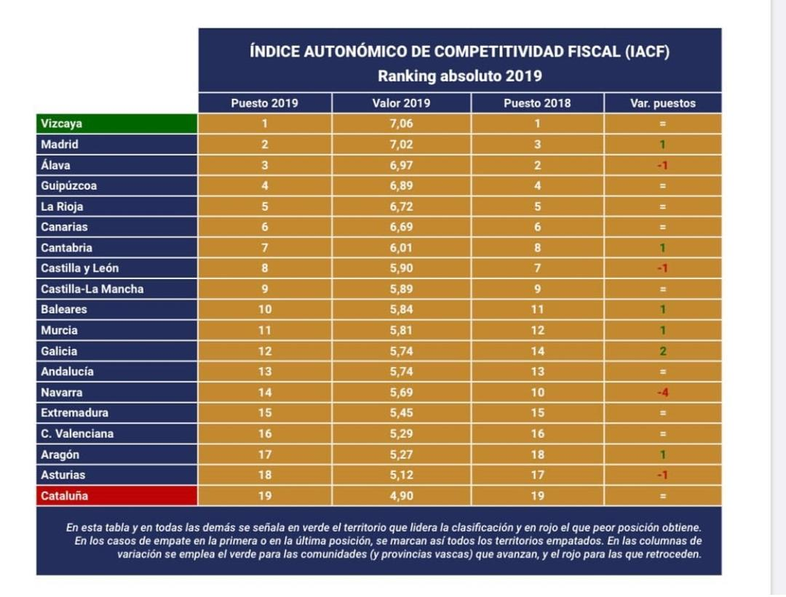

<script>
  $(document).ready(function() {
    $head = $('#header');
    $head.prepend('<div class="knitr source"></div>')
  });
</script>

```{r setup, include=FALSE}
knitr::opts_chunk$set(echo = TRUE)
```

```{r  message = FALSE, echo = FALSE}
library(rmdformats) #1
library(dplyr) #2
library(rvest) #3
library(reshape2)#4
library(ggplot2)#5
library(knitr)#6
library(kableExtra) #7
library(stringr) #8
library(ggthemes) #9
library(plotly) #10
library(tmap)   #11
```

# **INTRODUCCIÓN**
<div class=text-justify>
Este es el trabajo final de la asignatura "Introducción a R". Está realizado por el alumno Fernando Martínez. En él, se hara un repaso al contenido impartido en la asignatura, desde el tratamiento de tablas y vectores hasta el webscrapping. Se han usado diferentes librerías y métodos de tratamiento de datos. Se pretende hacer un comentario sobre las variables estadísticas que se muestran, espero que sea lo más certero posible dentro de mi alcance,
</div>
## **1. Expresiones regulares**
<div class=text-justify>
Las **expresiones regulares** (regex) son una herramienta para buscar cadenas de texto a través de una serie de sintaxis intrincada, son herramientas poderosas para usar en acciones como la búsqueda o la coincidencia de patrones.
Para buscar, podemos usar un carácter abreviado. Proporcionan una forma mucho más corta de escribir clases de caracteres de uso común. Por ejemplo, `[a-zA-z0–9]`. En lugar de escribir esa mezcla heterogénea de caracteres cada vez, simplemente podemos escribir `\ w`.

Para buscar cadenas que empiecen por un carácter y acaben por otro, utilizamos las **anclas** `^$`. Pero existe un problema, si ponemos una regex que busque palabras que empiecen por ‘g’ y acaben por ‘s’ del modo `[^gs$]`, nuestra regex va a buscar una cadena de dos caracteres, el contenido que haya entre medias le da igual, así que no soluciona nuestro problema.  

Una respuesta es una combinación de dos caracteres especiales: **el punto `.` y la estrella `*`**. El carácter de punto coincide con casi cualquier carácter, y el `*` coincide con cero o más apariencias de una expresión regular solicitada. Al usarlos entre nuestros anclajes, pedimos que devuelva una cadena de texto que empiece y acabe por lo que le pido, pero que no me importa lo que lleve en el medio siempre que lo devuelva.

Con esto, surge otro problema : no tenemos una manera de especificar hasta qué punto queremos que se extiendan esos caracteres. Este problema se puede solucionar utilizando el **cuantificador +** combinado con algunas clases de caracteres para crear una expresión regular más específica. Es por eso que para hacer expresiones regulares más avanzadas se usa `[^g[a-zA-z]+s$]` para buscar lo que empieza por g y acabe con s y que contenga unos caracteres alfabéticos dentro. 

1. [Jarroba.com](https://jarroba.com/busqueda-de-patrones-expresiones-regulares)

2. [Medium.com](https://medium.com/better-programming/the-joy-of-regular-expressions-part-1-what-is-regex-539dc581e282)

3. [Towardsdatascience.com](https://towardsdatascience.com/regular-expressions-explained-c9bce508e672)

Entre estas, para mi gusto la mejor página es la número 3, porque en ella se explicaban todas los caracteres usados en expresiones regulares y se daban consejos sobre cuáles es mejor usar en cada caso. En las demás, ponían y explicaban para qué se usaba cada caracter (como anclas, de cantidad, si matchean o no alfanuméricos...) pero no daban ejemplos ni decían las contraindicaciones de cada cuál. Sin embargo en la número tres sí: explican por qué usando solo anclas al principio y al final no se matchea una palabra entera, explica cómo eliminar los caracteres numéricos en tu expresión... 
Es por eso que me ha parecido mejor página para iniciarte en las expresiones regulares, o bien para refrescar el conocimiento de cara al uso intermedio. No son páginas que te lleven al uso avanzado de expresiones regulares. 
</div>

## **2. Recursos de Markdown**
<div class=text-justify>

### 2.1. Por qué Markdown

Markdown es un formato de documento abierto que es ampliamente usado para generar documentos HTML, documentos tipo presentación, generar tablas... Lo más interesante en el uso de Markdown es que es SIMPLE y muy versátil. Es abierto y flexible, es decir, cualquiera puede usarlo y además, puede convertirse de HTML a .doc con facilidad. Es limpio, porque genera el formateo a HTML de manera rápida sin perder información o estructura en el documento, lo que escribes en Markdown, se formatea a HTML sin pérdidas. Por supuesto, también admite todas las funcionalidades de R, para exportar gráficos, imágenes, datasets... Lo que lo convierte en un buen aliado a la hora de generar presentaciones. También es muy flexible en el apartado de la apariencia, ya que se puede cambiar el tema de Markdown instalando y retocando un tema creado por alguien o bien creando un tema personal nuevo.

### 2.2. Tablas
<p align="center">
Recursos | Ejemplo | Simbología
------------ | ------------- | --------------
Negrita | **Texto en negrita** | ** texto **
Cursiva | _Texto en cursiva_   | _ texto _ 
Links   | <https://github.com> | < texto >
Código  | `plot(iris)`         | `` texto dentro de comillas
</p>

Este es un ejemplo para que veamos cómo se pueden realizar tablas dentro de Markdown, algo tan cómodo como 
poner `Columna1 | Columna2` y debajo de todo esto una línea de guiones separada por un pipe `|`. Arriba, en el apartado de las expresiones regulares, también hemos visto la opción de hacer listas, mediante `·` u ordenadas mediante `1.`.

### 2.3. Citas

Otra de las cosas interesante que se pueden hacer es escribir citas usando el caracter `>`antes de escribir la cita: 

> El mundo está cambiando.

Conviene recordar que para empezar un nuevo párrafo hay que pulsar dos veces la tecla enter, o si no nuestro código o nuestro texto formateado puede desordenarse y quedar bastante caótico. Por ejemplo, otra de las características que estamos usando en este documento es el poder poner encabezados, los cuales son de primer nivel con un `#`, de segundo nivel con dos, tercer nivel con tres... etcétera. 

### 2.4. Ejemplo de listas

En este ejemplo sobre listas, aprovecho para destacar las páginas de consulta que he usado para crear este documento.

1. [MasteringMarkdown](https://guides.github.com/features/mastering-markdown/)

2. [DataDreaming](https://www.datadreaming.org/post/r-markdown-theme-gallery)

3. [RMarkdown](https://rmarkdown.rstudio.com/index.html)

Sin lugar a dudas, la mejor opción para iniciarse en el mundo de Markdown es la tercera. En esa página, se explica detalladamente todos los elementos necesarios para crear un buen documento HTML. En principio, muestra sólo lo que contiene el paquete básico, pero acompañándola con el dominio de RStudio y con búsquedas por internet, tienes la posibilidad de crear un documento muy digno y con un esfuerzo relativamente bajo. 

### 2.5. Incluir gráficos

Como comentaba en el punto 2.1. también es posible incluir gráficos, utilidad que veremos en profundidad en siguentes apartados.

```{r fig.align="center", echo=FALSE}
plot(iris$Petal.Length, main = "Longitud de Pétalo de las especies", xlab = "Muestras", ylab = "Longitud de Pétalo")
abline(h=3, col = "green")
abline(h=5, col = "blue")
abline(h=7, col = "red")
abline(v=0)
abline(v=50)
abline(v=100)
abline(v=150)
```
</p>

### 2.6. Formateo de texto
<p align="center">
Función | Código
--------|-------
Justificar texto | `<div class=text-justify> texto </div>`
Centrar texto    | `<p align="center"> texto/imagen </p>`
Imagen a la izquierda | ``
Imagen a la derecha | ``

</p>

### 2.7. Temas

Otra funcionalidad de Markdown es la posibilidad de cambiar de tema a tu gusto, o bien escribiendo tu propio tema con los colores que desees (tarea salomónica) o bien instalando un tema que alguien haya realizado en su casa. El tema que yo voy a usar se llama `readthedown` del paquete `rdmformats`. Por ejemplo, en este tema las gráficas y las imágenes aparecen de forma muy discreta para no sobrecargar la página, pero se amplian a tamaño real al pulsar sobre ellas. Es una funcionalidad muy agradable de cara a la lectura de la página.

</div>

## **3. Estudio de datos**

<div class=text-justify>

### 3.1. Paro en Murcia: tablas

<div class=text-justify>

Voy a extraer datos desde un dataset llamado `paro`. Para ello, va a ser necesario instalar (si no está ya instalado) el paquete `dplyr` y `reshape2` y cargar las librerías.

```{r  echo = FALSE}
paro <- read.csv("resources/paro.csv", header = TRUE, sep = "\t", encoding = 'UTF-8')
paro1 <- paro%>%
  filter(Provinces == "30 Murcia")
murcia <- paro1%>%
  select(Gender, Periodo, Situation, value)
murdcast <- dcast(murcia, Gender+Periodo~Situation)

```

Voy a evaluar los datos de paro en Murcia a lo largo de la historia (léase historia como el periodo tiempo que incluye el archivo). La siguiente tabla incluye todas las variables que presenta el archivo paro.

```{r echo = FALSE}
kable(paro[1:6,]) %>%
  kable_styling(bootstrap_options = c("striped", "hover"))
```

Como el archivo está demasiado sucio e incomprensible a simple vista, voy a seleccionar usando el paquete `dplyr`, solo los datos históricos que pertenezcan a Murcia.

```{r echo = FALSE}
kable(paro1[1:6,]) %>%
  kable_styling(bootstrap_options = c("striped", "hover"))
```

Una vez seleccionada Murcia, elimino la columna `Provinces` porque ya no aporta ningún valor. Además, voy a poner la tabla en formato ancho usando `dcast` porque me intersa saber qué tipo de trabajador hay en cada periodo de forma rápida y visual. Para ello, también he ordenado la tabla por periodo.

```{r echo = FALSE}
kable(murdcast[1:6,]) %>%
  kable_styling(bootstrap_options = c("striped", "hover"))

```
</div>

### 3.2. Paro en Murcia: gráfica con ggplot

<div class=text-justify>

De cara a realizar un gráfico, voy a sustituir todos los `Qi` por su correspondiente fecha `as.character`. El siguiente gráfico muestra la variación de la tasa de paro en Murcia durante los años 2011 y 2015, separado por facetas (hombres y mujeres). 

```{r echo= FALSE}
murdcast$Periodo <- as.character(murdcast$Periodo)
murdcast$Periodo <- gsub("Q1", "-03-31", murdcast$Periodo)
murdcast$Periodo <- gsub("Q2", "-06-30", murdcast$Periodo)
murdcast$Periodo <- gsub("Q3", "-09-30", murdcast$Periodo)
murdcast$Periodo <- gsub("Q4", "-12-31", murdcast$Periodo)
murdcast$Periodo <- as.Date(murdcast$Periodo)

murdcast$tasa.paro <- 100 * murdcast$unemployed / murdcast$active
graf <- ggplot(murdcast, aes(x = Periodo, y = tasa.paro)) +    
  geom_line()+geom_smooth(alpha = 0.15, method = 'auto')+facet_wrap(~Gender)
```

```{r fig.align="center",message = FALSE, echo = FALSE}
graf + theme_economist() + scale_colour_economist()
```

Como podemos ver, la tasa de paro en hombres es menor que la de mujeres. Esto puede deberse a varios factores. Por ejemplo, **generalizando**, las personas que trabajan en la agricultura son, en su mayoría, inmigrantes de África que no conocen el idioma. En este caso, la cantidad de hombres que eligen trabajar en la agricultura es mayor que la de mujeres. Los hombres estarían asegurados por la empresa (o por sí mismos) y cotizando a la seguridad social, mientras que las mujeres inmigrantes en Murcia tienden más al cuidado de personas o a la limpieza de hogares, muchas de ellas (lamentablemente) no tienen contrato, por diversas causas. Esto hace que las mujeres aparezcan más como desempleadas. Es una de las razones que se me ocurren, aunque habrá muchísimas más. Con los datos de los que dispongo aquí, no puedo hacer un análisis sobre por qué los hombre están menos desempleados que las mujeres. 

```{r echo= FALSE}
paro$Periodo <- as.character(paro$Periodo)
paro$Periodo <- gsub("Q1", "-03-31", paro$Periodo)
paro$Periodo <- gsub("Q2", "-06-30", paro$Periodo)
paro$Periodo <- gsub("Q3", "-09-30", paro$Periodo)
paro$Periodo <- gsub("Q4", "-12-31", paro$Periodo)
paro$Periodo <- as.Date(paro$Periodo)

comparacion <- paro[paro$Provinces=="30 Murcia" | paro$Provinces=="28 Madrid",]
dcomparacion <- dcast(comparacion, Provinces + Gender+Periodo~Situation)
dcomparacion$tasa.paro <- 100 * dcomparacion$unemployed / dcomparacion$active
graf1 <- ggplot(dcomparacion, aes(x = Periodo, y = tasa.paro, col = Gender)) +    
  geom_line()+geom_smooth(alpha = 0.15, method = 'auto')+facet_wrap(~Provinces)
```

```{r fig.align="center",message = FALSE, echo = FALSE}
graf1 + theme_economist() + scale_colour_economist()
```

Como podemos ver, en ambas provincias aumenta la tasa de paro en los años más duros de la crisis. Sin embargo, es en Madrid donde menos paro hay. Recientes estudios demuestran que la Comunidad de Madrid, desde el año 1996, se ha "aprovechado" del grandísimo invento que son las autonomías para rebajar su carga impositiva y atraer a más inversores y a más empresas. La baja fiscalidad de Madrid, que se sitúa hoy en el puesto número 2 del Índice autómico de competitividad fiscal, hace de esta comunidad una especie de "oasis" para las empresas, que vienen a invertir y a crear puestos de trabajo, tanto modernos y tecnológicos como los usuales que estamos acostumbrados a ver. 

Murcia, sin embargo, ocupa un puesto por debajo de la mitad de la tabla: 11 sobre 19. Los casos de corrupción han perjudicado a la comunidad, pero también la crisis mundial y las terribles inundaciones en las zonas de costa. La burbuja inmobiliaria afectó como en toda España, claro; sin embargo, al ser una zona que vive casi enteramente del turismo y la agricultura, tener la costa desolada por inundaciones añadido a la crisis mundial y a la decisión de Reino Unido de salir de la Unión Europea ha derivado en que Murcia haya sido una gran afectada durante los años en los que se ha medido la actividad laboral.

<center>


</center>

</div>
</div>

## **4. Webscrapping: IMDb**
<div class=text-justify>

``` {r  echo = FALSE}
#Extracción de url y lectura de formato tabla

url.imdb <- "https://www.imdb.com/chart/top/?ref_=nv_mv_250"
tmp <- read_html(url.imdb) 
tmp <- html_nodes(tmp, "table")
dimension <-sapply(tmp, function(x) dim(html_table(x, fill = TRUE))) 
IMDB <- html_table(tmp[[1]])
IMDB1 <- IMDB

#Cambio el nombre a las columnas

names(IMDB)<- c("Posición", "Título", "Rating_IMDb","DontCare", "DontCare1")

#Selección de las columnas que quiero
  
IMDB<-IMDB%>%
  select(Posición, Título, Rating_IMDb)

#Limpieza de la columna título y creación de un contador de posición

vector <- IMDB$Título 
vector <-   gsub("[0-9]+[.]\n", "", vector)
vector <-  gsub("\n", "", vector)

IMDB$Título <- vector 
IMDB$Posición <-1:length(IMDB$Posición)
tmp1 <- IMDB$Título
nombre <- tmp1
nombre <- gsub("[(]", "", nombre)
nombre <- gsub("[)]", "", nombre)
Película <- gsub("[1-2][0-9][0-9][0-9]","", nombre)
Películas <- gsub("[ ][ ]+","", Película)

#Extracción de la fecha de estreno
tmp1 <- IMDB$Título
Estreno <- str_extract(tmp1, "[1-2][0-9][0-9][0-9]")


#Incorporo la columna Estreno y Nombre a mi tabla  

IMDB$Estreno <- as.numeric(Estreno)
IMDB$Película <- Películas

#Selecciono columnas Posición, Película, Estreno y  Rating_IMDb

DATABASE <- IMDB%>%
  select(Posición, Película, Estreno, Rating_IMDb)

```

En este aparatado, voy a hacer `webscrapping` en la web de IMDb. Al hacerlo, queda una tabla bastante desordenada que tenemos que limpiar para que se vea bien lo que queremos:

```{r echo=FALSE, message = FALSE}
head(IMDB1)
```

Como vemos, aparece la tabla de IMDb con los nombres de columnas que ellos han elegido, y con un formato horrible. Admemás, la tabla incluye columnas para dar puntuación a cada película online, nosotros no queremos eso. Hacemos un proceso de depurado de los datos y cambiamos nombres de columnas. Creamos una columna sólo para el nombre de la película y otra sólo para el año de lanzamiento: 

```{r echo = FALSE, message = FALSE}
kable(DATABASE[1:10,]) %>%
  kable_styling(bootstrap_options = c("striped", "hover"))
```

Ahora, quiero mostrar qué triste, y feliz para todos a la vez, fue el año 1994. 

```{r echo = FALSE, message = FALSE}
kable(DATABASE[Estreno == "1994",]) %>%
  kable_styling(bootstrap_options = c("striped", "hover"))
```

Al final, fue Forrest Gump la que ganó el premio a la mejor película, pero estoy seguro de que ha sido el año más disputado de la historia. Como no podía ser de otra manera (y como imagino que ya sabes y además has visto aquí), la mejor película de la historia (y mi película favorita) no se llevó el premio, pero sí ha ganado el premio de estar primera el el _Hall of Fame_ de toda una generación.

```{r echo = FALSE, message = FALSE}
kable(DATABASE[1,]) %>%
  kable_styling(bootstrap_options = c("striped", "hover"))
```

Aquí, presentamos un gráfico dinámico en el que aparecen las 10 películas mejor valoradas de la historia.

```{r , echo=FALSE, message=FALSE, warning = FALSE}

toppelis<-DATABASE[1:10,]

plot_ly(data = toppelis, x = ~Estreno, y = ~Rating_IMDb, color = ~Película, type = "scatter", mode = "markers", size = 30) %>%
  layout(title = 'Películas', 
         xaxis = list(title = 'Año'),
         yaxis = list(title = "Rating"))

```
</div>
